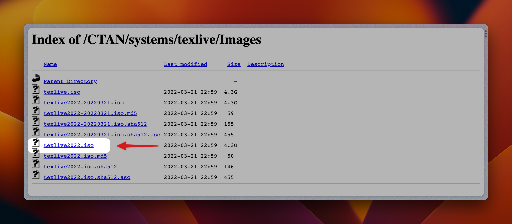
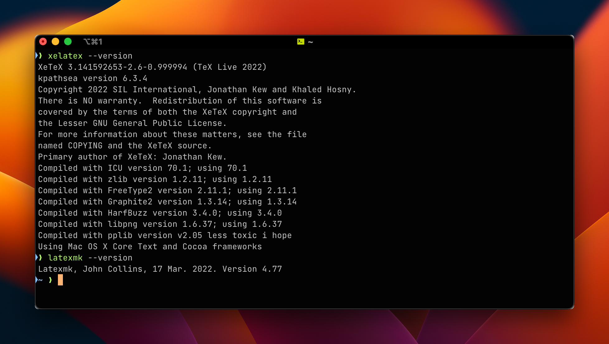
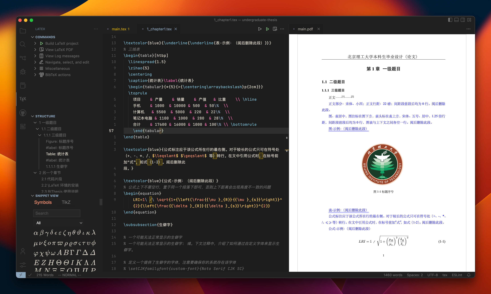

# 🍌 如何开始

## 准备工作

首先，在使用模板之前，你需要在本机安装 LaTeX 环境。一个完整的 LaTeX 环境包括：

- 开源免费的 LaTeX 发行版（包含有必备的 LaTeX 编译器与有用的宏包）
- 以及一个得心应手的 LaTeX 编辑器

我们在 Windows、macOS 与 Linux 环境中均可以使用 LaTeX 进行文档撰写。按照操作系统的不同，我们分别进行介绍。

## 下载合适的 LaTeX 发行版

:::warning ❗ 请注意
BIThesis 中参考文献为了和校方规定的模板格式（[信息与文献 参考文献著录规则 - GB/T 7714-2015](https://openstd.samr.gov.cn/bzgk/gb/newGbInfo?hcno=7FA63E9BBA56E60471AEDAEBDE44B14C)）保持一致，使用了仅支持 TeX Live 2019 及以上版本的宏包，如果你曾经安装过 TeX Live 且目前正在使用的 TeX Live 版本不是 2019 及以上版本，那么请及时更新为最新的 TeX Live 2019 及以上版本。
:::

### Windows 和 Linux 系统

对于 Windows 和 Linux 系统，我们可以直接下载使用 [TeX Live 发行版](https://www.tug.org/texlive/)。

- **在线安装**：官方的安装指南位于 - [Installing TeX Live over the Internet](https://www.tug.org/texlive/acquire-netinstall.html)。使用这一方法会下载 `install-tl-windows.exe`（Windows）或 `install-tl-unx.tar.gz`（Linux），之后运行相应的可执行程序，安装程序即可将整个 TeX Live 发行版下载安装到我们本机。（通常会安装 3GB 左右的程序。）
- **离线安装**：使用北京理工大学校园网的同学也可以直接使用我校官方 TeX Live 镜像进行安装。我校 TeX Live 镜像资源位于 [/CTAN/systems/texlive/Images](https://mirrors.bit.edu.cn/CTAN/systems/texlive/Images/)，其中我们选择下载 `texlive20xx.iso` 即可。Windows 10 及以上版本可直接挂载 ISO 镜像（双击即可），其余系统用合适的软件也可。之后在打开的文件夹中点击执行 `install-tl-windows`（Windows）或 `install-tl`（Linux）即可离线安装全部 TeX Live 组件。

  :::warning ❗ 请注意
  北理工镜像站自 2021 年 2 月 18 日起，已经[停止校外 IPv4 访问的支持](https://github.com/BITNP/issues/issues/29)。因此当我们访问上面镜像资源时，有可能无法打开。对此我们可以选用其他的镜像源。

  另注：安装过程中注意使用合适的权限。
  :::

  

- **使用包管理工具进行安装**：使用 Linux 系统的同学也可以选择使用合适的包管理工具进行 TeX Live 的安装。以 Ubuntu 为例子，只需要运行：

  ```bash
  sudo apt install texlive
  ```

  即可下载安装整个 TeX Live 发行版。

### macOS 系统

对于 macOS 系统，我们可以直接下载使用 [MacTeX 发行版](https://www.tug.org/mactex/)。MacTeX 发行版是以 `pkg` 文件进行发布安装的，我们进入 [MacTeX 的下载页面](https://www.tug.org/mactex/mactex-download.html)，点击下载 `MacTeX.pkg` 即可下载完整的 MacTeX 安装包（大约 3.9GB）。之后双击运行即可安装。

另外，使用 Homebrew 包管理的同学，也可以通过 Homebrew Cask 直接安装 MacTeX：

```bash
# 加载 Homebrew Cask
brew tap caskroom/cask

# 利用 Cask 安装 MacTeX
brew cask install mactex
```

### 确认安装

为了保证我们 LaTeX 发行版的安装没有问题，我们需要验证一下 LaTeX 编译工具的安装情况。我们打开终端（Windows 打开 PowerShell、macOS 打开 Terminal、Linux 打开你所使用的终端模拟器），在其中输入下面的命令：

- 验证 `latexmk`、`xelatex` LaTeX 编译器的安装情况：

  ```bash
  # 验证 latexmk 的安装
  latexmk --version
  # 验证 xelatex 的安装
  xelatex --version
  ```

  

- 验证 `biber` 参考文献编译器的安装情况：

  ```bash
  biber --version
  ```

  

出现类似的输出，说明我们编译器安装应该是没有问题的。

## 挑选合适的 LaTeX 编辑器

理论上来说，任何一个「文本编辑器」均可以用来撰写 LaTeX 文档，但是一个得心应手的 LaTeX 编辑器一定会让我们撰写论文的效率大增。

### 使用 VS Code 配合 LaTeX Workshop 插件编辑 LaTeX 文档

VS Code 是微软开发的基于 Electron 跨平台技术的新晋代码编辑器，开源免费、拓展性强、功能强大，是当代开发者的首选。用 VS Code 配合 LaTeX Workshop 插件我们可以打造一个强大的 LaTeX 编辑器。



- 安装 VS Code 编辑器：[Visual Studio Code - Code editing. Redefined.](https://code.visualstudio.com/)
- 安装插件：
  - 安装 LaTeX Workshop 插件：[Visual Studio Code LaTeX Workshop Extension](https://marketplace.visualstudio.com/items?itemName=James-Yu.latex-workshop)
    - 提供基本的浏览、编辑、自动补全、自动格式化 LaTeX 文档的功能
    - 提供在 VS Code 内直接预览 LaTeX 文档编译得到的 PDF 的功能
    - 提供编译工具链、自定义编译方法等功能
    - 提供 SyncTeX 双向定位功能（LaTeX 源码 <-> PDF）
  - （可选）安装 LaTeX Utilities 插件：[Visual Studio Code LaTeX Utilities](https://marketplace.visualstudio.com/items?itemName=tecosaur.latex-utilities)
    - 提供实时 LaTeX 文档字数统计的功能
    - 提供与参考文献管理工具 Zotero 连接的功能

使用 VS Code 作为 LaTeX 编辑器时，我们需要特别配置编译工具 `tools` 与编译工具链 `recipes`。对于包含有目录、参考文献、图片与表格引用的 LaTeX 文档，我们往往需要使用多个编译工具串联编译。具体的 VS Code 编译方法，请继续阅读。

### 使用 TeXstudio 编辑 LaTeX 文档

TeXstudio 是老牌 LaTeX 编辑器，使用跨平台技术 Qt 编写而成。虽然界面相对老旧，但是依旧可靠。我们可以去 [TeXstudio 的官网](https://www.texstudio.org/)下载安装各个系统版本的 TeXstudio。


默认情况下 TeXstudio 的编译工具链均已经配置完毕，基本开箱即用。对于如何用 TeXstudio 编译本模板，请继续阅读。

准备就绪后，我们就可以开始使用 BIThesis 提供的模板进行 LaTeX 文档的撰写啦！请继续阅读：[📃 下载与使用模板](./downloading-using-templates.md)。
